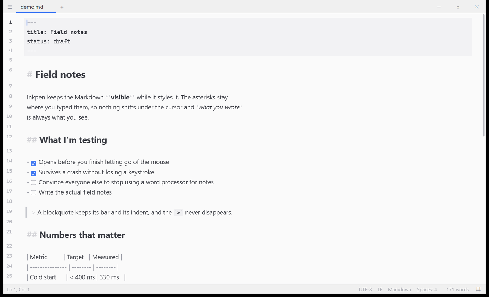

<p align="center">
  
</p>

<h1 align="center">Inkpen</h1>

<p align="center"><b><i>Less is more.</i></b></p>

<p align="center">
  A Markdown editor that opens instantly, stays out of your way,<br>
  and never loses what you typed.
</p>

<p align="center">
  Windows &middot; 3.6 MB installer &middot; no administrator needed &middot; no account, no cloud, no telemetry
</p>

<p align="center">
  <a href="https://github.com/apis7/inkpen/releases">Download</a> &middot;
  <a href="#what-its-like-to-use">What it's like</a> &middot;
  <a href="#everything-it-does">Features</a> &middot;
  <a href="#tell-me-what-to-take-out">What to take out</a> &middot;
  <a href="#a-note-on-how-this-was-built">How it was built</a>
</p>

<p align="center">
  <picture>
    <source media="(prefers-color-scheme: dark)" srcset="docs/screenshot-dark.png">
    
  </picture>
</p>

---

## Why this exists

Most editors want to be your whole workspace. They bring an AI assistant, a
terminal, source control, a plugin marketplace and a language server, and they
take a few seconds and several hundred megabytes to tell you so.

Sometimes you just want to write something down.

Inkpen is the small end of that trade. It opens in about a third of a second,
it holds tabs, it understands Markdown properly, and it does nothing else. The
whole installer is smaller than a phone photo.

## What it's like to use

**Your Markdown stays readable while you write it.** Headings look like
headings and bold text looks bold, but the `#` and the `**` stay right where
you typed them. Nothing jumps around under your cursor, and what you see is
what's actually in the file. Tick a checkbox in a task list and the file
updates.

**It won't lose your work.** Every keystroke is written to a small recovery
log as you type. Pull the power cord and the text is still there when you come
back. Saving is done in a way that keeps the original file's permissions and
timestamps intact, so nothing downstream gets confused about what changed.

**It handles the messy files.** Legacy encodings, mixed line endings, that
document someone emailed you from 2004 — it detects what it's looking at,
shows you in the status bar, and writes it back byte-for-byte the way it found
it unless you ask otherwise.

**Copy actually works.** Copy from Inkpen and paste into a terminal, a chat
box or a form, and you get plain text — not a wall of invisible formatting.
Rich text is there when you want it, as a separate command.

**It fits into Windows.** Double-click a `.md` file and it opens. Right-click
in a folder and there's a "Markdown Document" under New. Drag a file onto the
window. Your tabs come back where you left them.

## Everything it does

| | |
| --- | --- |
| **Writing** | Live Markdown styling, tabs with drag-to-reorder, find and replace, multiple cursors, code folding, spellcheck, word count, typewriter mode, and a command palette for everything else |
| **Markdown** | GitHub-flavoured tables, task lists, front matter, inline image previews, math, an outline panel, and automatic list and table tidying |
| **Also opens** | Plain text, JSON, YAML, TOML, INI, CSV, logs, and source files in roughly 130 languages |
| **Files** | Autosave, crash recovery, encoding detection, notice when a file changes on disk, and large files opened without the editor bogging down |
| **Sharing** | Export to HTML or PDF, print, and copy a selection as rich text |
| **Yours** | Light and dark themes, custom themes, remappable keys, adjustable font and spacing, optional Vim mode |

And a short list of what it deliberately does not do: no AI, no terminal, no
git integration, no language servers, no plugin store, no sign-in, no
telemetry of any kind. Nothing leaves your machine.

## Tell me what to take out

Bug reports are welcome. So is the opposite kind of report: **suggestions for
features to remove.**

Everything in that table costs something. A millisecond at startup, a line in
a menu, one more thing to learn, one more thing that can break. If some part
of Inkpen feels like clutter, or you've had it installed for a month and never
touched a particular feature, that is worth
[an issue](https://github.com/apis7/inkpen/issues). "Get rid of the outline
panel" is as useful to me as "the outline panel is broken" — arguably more.

Yes, removing a feature means one less feature. It also means less to load,
less to render, less to maintain and less in your way. That trade is the whole
point of this editor, and it only holds if things come out as readily as they
go in.

Less is more.

## Getting it

Grab the installer from [Releases](https://github.com/apis7/inkpen/releases)
and run it. It installs for your user account only, so it doesn't need an
administrator password.

It isn't code-signed, so Windows SmartScreen will show a warning the first
time. Choose **More info**, then **Run anyway**. Code-signing certificates
cost real money and this is a free project.

## How fast, concretely

Measured on an ordinary laptop, not a benchmark rig:

| | |
| --- | --- |
| Opening the app | about a third of a second to a blinking cursor |
| Cost of a keystroke | roughly 1.6 ms, in a frame with 6 ms to spare |
| Opening a 1 MB document | about 90 ms |
| Installer | 3.6 MB |

## A note on how this was built

Inkpen was written by Claude, Anthropic's coding agent, working from a
specification and steady feedback from one person. Every feature here was
tested by hand, and the code carries 200 automated tests. But it's worth
being straightforward about it: this is agent-written software, it's version
0.1, and it hasn't yet been through the kind of use that shakes out the
last bugs.

Your files are treated carefully — atomic saves, a recovery journal, no
network access at all — but keep backups of anything you'd hate to lose, the
same as you would with any new tool. If something goes wrong,
[open an issue](https://github.com/apis7/inkpen/issues) — the About dialog
links to a diagnostic log that makes reports much easier to act on. And as
above, issues proposing that something be *taken out* are just as welcome as
bug reports.

## Building it yourself

You'll need Rust with the MSVC toolchain, Node, and pnpm.

```sh
cd app
pnpm install
pnpm app:dev          # run with hot reload
pnpm app:build        # produce the installer
```

Tests:

```sh
pnpm exec vitest run             # frontend
cd src-tauri && cargo test --lib # backend
```

Icons are regenerated from the artwork in `icons/` with
`python icons/build_icons.py`.

Built on [Tauri](https://tauri.app), [CodeMirror](https://codemirror.net) and
[SolidJS](https://solidjs.com), which deserve most of the credit for the speed.

## Licence

MIT. Do what you like with it.
